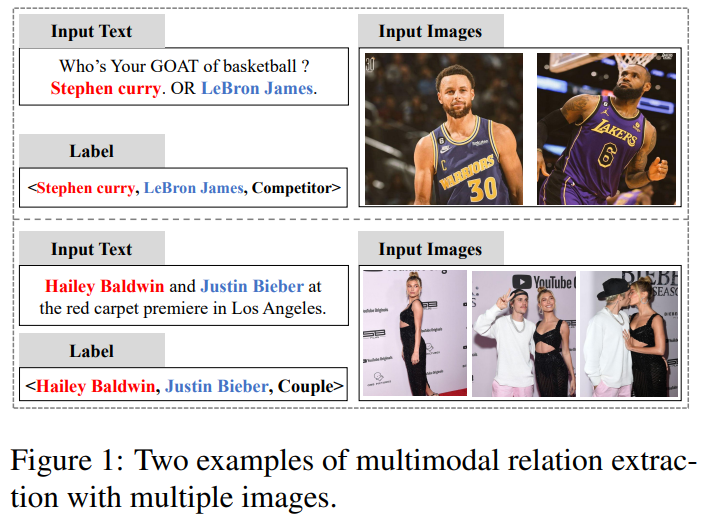
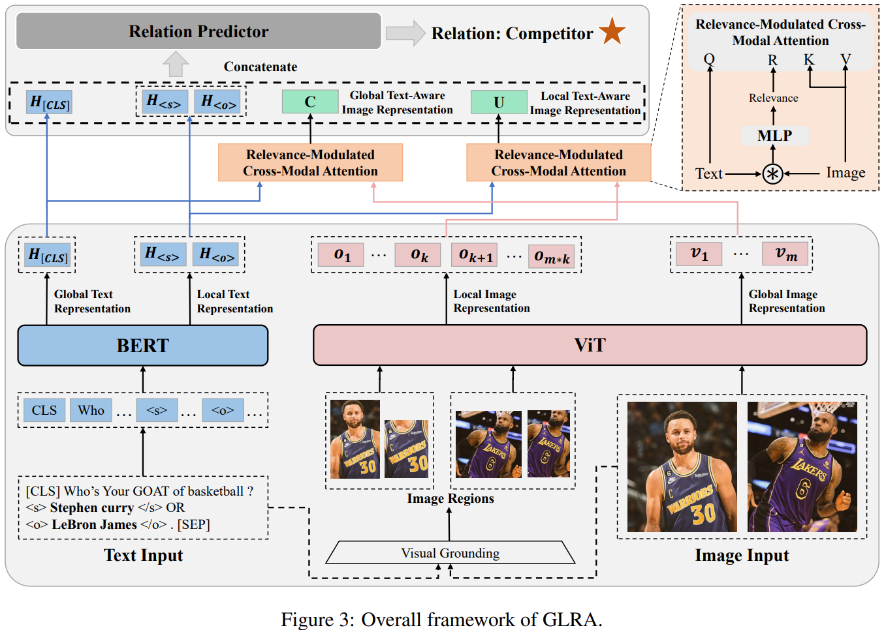

# MRE-MI: A Multi-image Dataset for Multimodal Relation Extraction in Social Media Posts

The pytorch implementation of "MRE-MI: A Multi-image Dataset for Multimodal Relation Extraction in Social Media Posts" and publication of the **MRE-MI** dataset (NAACL 2025).

**MRE-MI** is the abbreviation of **M**ultimodal **R**elation **E**xtraction with **M**ultiple **I**mages, a MRE task with multi-image scenarios.


The repository contains the dataset MRE-MI proposed in the paper as well as an implementation of the GLRA framework.

The examples of MRE-MI are shown in the following figure:



The framework of GLRA is shown in the following figure:



## Enviroment
We recommend the following actions to create the environment:
```bash
conda create -n  MRE-MI python==3.9.19
conda activate MRE-MI
pip install torch==2.1.2 torchvision==0.16.2 --index-url https://download.pytorch.org/whl/cu121
pip install transformers ==4.51.3
pip install tokenizers ==0.21.1
```

## Dataset Download & Introduction
In this paper, we introduce a dataset called MRE-MI.

You can download this dataset via Baidu Netdisk, and the download links are as follows: https:xxx

After downloading, you need to unzip the downloaded files and place them in the `dataset` folder, and the file structure should appear as follows:

```bash
dataset
|-- images  # images
|-- images_vg # images acquired through visual grounding tools
|-- images_vg.pth # dictionary corresponding to images and vg_images
|-- train.txt # training set
|-- val.txt # validation set
|-- test.txt # test set
```

The format of each instance in text file is as follows:

```json
{"id": "11573", "tokens": ["Jason", "Isaacs", "and", "Emma", "Hewitt", "Married", "for", "21", "years", ",", "happy", "and", "in", "love", ".", "(", "Getty", "Image", ")"], "h": {"name": "Jason Isaacs", "pos": [0, 2]}, "t": {"name": "Emma Hewitt", "pos": [3, 5]}, "images": ["11573_0.jpg"], "relation": "/per/per/couple"}
```
The `id` represents the data identifier, `tokens` contains the words in text, `h` is the head entity name and its position, `t` is the tail entity name and its positionm `images` corresponds to the images associated with the instance, `relation` represents the label.

## Required pre-trained models
In our paper, we use BERT and VIT as text encoder and image encoder, respectively.

For the code implementation, we utilized the models and weights provided by Hugging Face. 
The respective Hugging Face links are: https://huggingface.co/google-bert/bert-base-uncased and https://huggingface.co/google/vit-large-patch32-384.

## Running
After you have prepared the required enviroment, data, and models, you can run `python run.py` to train a model.